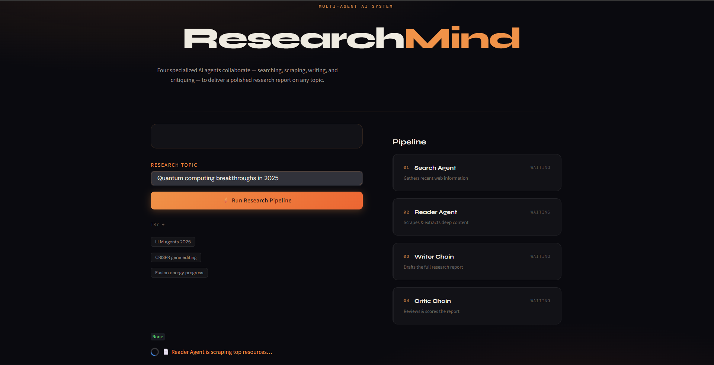
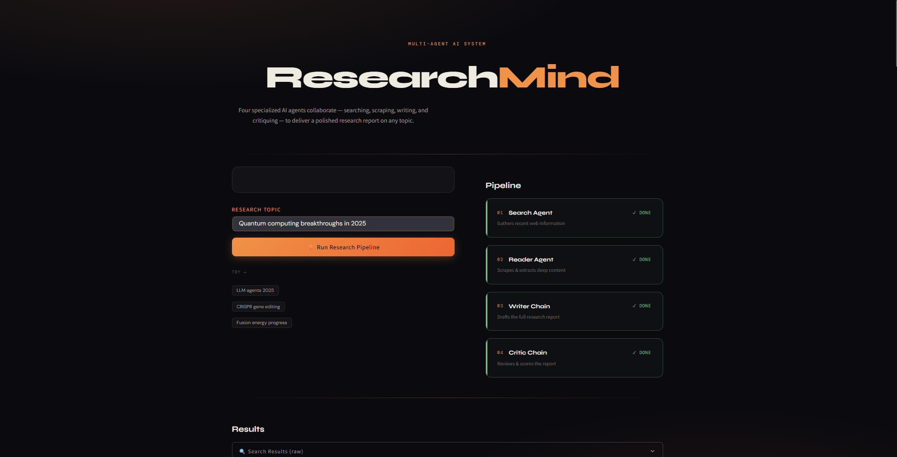
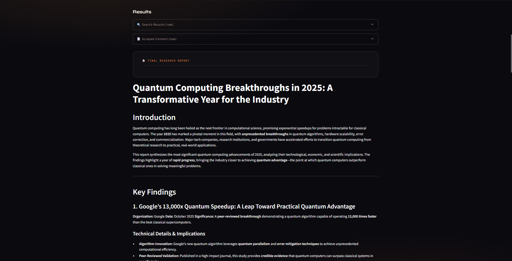
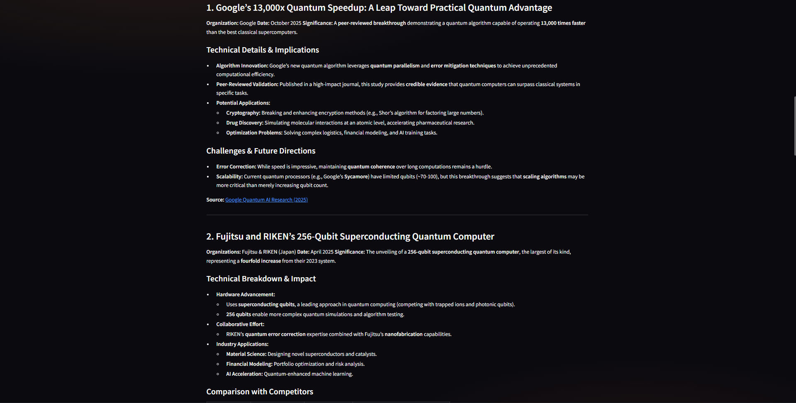
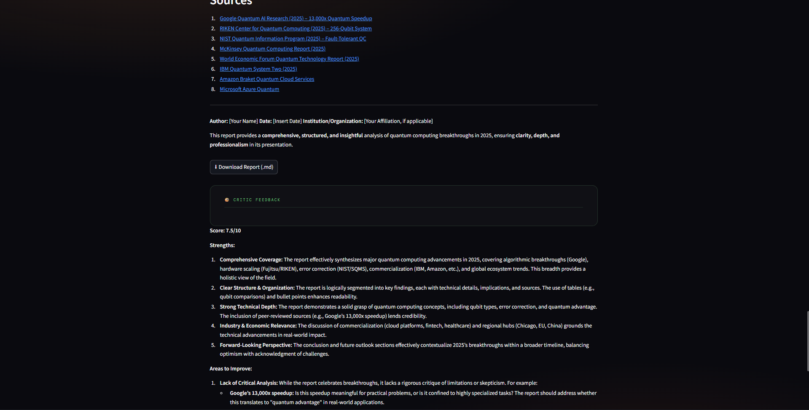

# 🤖 Multi-Agent Research System

An advanced **AI-powered Multi-Agent Research System** designed to automate research workflows using multiple intelligent AI agents working collaboratively. This project combines the capabilities of **Large Language Models (LLMs)**, **agentic AI architectures**, **web research pipelines**, and **task orchestration** to generate detailed, context-aware, and high-quality research outputs 📚✨

The system enables multiple AI agents to perform specialized tasks such as:
- Information Retrieval
- Web Research
- Summarization
- Analysis
- Report Generation
- Knowledge Synthesis

using an intelligent collaborative architecture.

---

# 🔗 GitHub Repository

https://github.com/Sahil-Shrivas/Multi_Agent_Research_System-Project.git

---

# 📖 Introduction

Traditional AI systems usually rely on a single Large Language Model to answer questions or generate outputs. However, complex research tasks often require:
- Information gathering
- Data validation
- Multi-step reasoning
- Task decomposition
- Context aggregation

This project solves that limitation using a **Multi-Agent AI Architecture**, where different AI agents collaborate together to complete sophisticated research tasks more effectively.

Each agent is assigned a specialized responsibility, making the entire system more scalable, modular, and intelligent.

The system can:
- Perform autonomous web research
- Analyze multiple information sources
- Generate summarized insights
- Produce structured reports
- Improve response quality through collaboration

---

# 🚀 Features

## 🤖 Multi-Agent Architecture
- Multiple AI agents working collaboratively
- Task-specific agent specialization
- Distributed research workflow

## 🌐 Automated Web Research
- Collects information from online sources
- Retrieves relevant data dynamically
- Enhances factual accuracy

## 🧠 Intelligent Task Decomposition
- Breaks complex tasks into smaller subtasks
- Assigns subtasks to different agents
- Optimizes research efficiency

## 📄 AI-Based Summarization
- Generates concise summaries
- Extracts important insights
- Reduces information overload

## 📊 Research Report Generation
- Creates structured research outputs
- Combines insights from multiple agents
- Produces detailed reports

## 🔍 Context-Aware Information Retrieval
- Retrieves relevant information intelligently
- Maintains contextual continuity
- Supports advanced reasoning

## ⚡ Scalable AI Workflow
- Modular and extensible architecture
- Easy integration of additional agents
- Optimized execution pipeline

## 🎨 Interactive Interface
- User-friendly application design
- Easy interaction with AI agents
- Real-time research generation

---

# 🛠️ Tech Stack

| Technology | Purpose |
|------------|----------|
| Python | Core programming language |
| LangChain | Agent orchestration |
| CrewAI / Multi-Agent Framework | Multi-agent collaboration |
| OpenAI / Mistral LLM | Large Language Models |
| Streamlit | Frontend interface |
| Web Search APIs | Online research |
| Vector Databases | Knowledge retrieval |
| HuggingFace | NLP models & embeddings |

---

# 🏗️ System Architecture

```text
                    ┌────────────────────┐
                    │    User Query      │
                    └─────────┬──────────┘
                              │
                              ▼
                    ┌────────────────────┐
                    │  Task Coordinator  │
                    └─────────┬──────────┘
                              │
          ┌───────────────────┼───────────────────┐
          │                   │                   │
          ▼                   ▼                   ▼
 ┌────────────────┐ ┌────────────────┐ ┌────────────────┐
 │ Research Agent │ │ Analysis Agent │ │ Summary Agent  │
 └────────┬───────┘ └────────┬───────┘ └────────┬───────┘
          │                   │                   │
          └───────────────────┼───────────────────┘
                              │
                              ▼
                    ┌────────────────────┐
                    │ Report Generator   │
                    └─────────┬──────────┘
                              │
                              ▼
                    ┌────────────────────┐
                    │   Final Output     │
                    └────────────────────┘
```

---

# 📂 Project Structure

```bash
Multi_Agent_Research_System-Project/
│
├── Screenshots/
│   ├── Screenshot1.png
│   ├── Screenshot2.png
│   ├── Screenshot3.png
│   └── Screenshot4.png
│
├── agents/
│   ├── researcher.py
│   ├── analyzer.py
│   ├── summarizer.py
│   └── coordinator.py
│
├── tools/
│   ├── web_search.py
│   ├── scraper.py
│   └── utilities.py
│
├── vector_store/
│
├── app.py
├── main.py
├── requirements.txt
├── README.md
└── .env
```

---

# 📸 Project Screenshots

## 🏠 Complete Project Structure



---

## 🤖 Multi-Agent Workflow



---

## 🌐 Automated Research Process



---

## 📊 AI Generated Research Output



---

## 🎨 Application Interface



---

## 📊 AI Generated Research Output

```md

```

---

# ⚙️ Installation Guide

## 1️⃣ Clone the Repository

```bash
git clone https://github.com/Sahil-Shrivas/Multi_Agent_Research_System-Project.git
cd Multi_Agent_Research_System-Project
```

---

## 2️⃣ Create Virtual Environment

### Windows

```bash
python -m venv venv
venv\Scripts\activate
```

### Mac/Linux

```bash
python3 -m venv venv
source venv/bin/activate
```

---

## 3️⃣ Install Dependencies

```bash
pip install -r requirements.txt
```

---

# 🔑 Environment Variables

Create a `.env` file inside the root directory:

```env
OPENAI_API_KEY=your_api_key_here
MISTRAL_API_KEY=your_api_key_here
```

---

# ▶️ Run the Application

Start the application using:

```bash
streamlit run app.py
```

or

```bash
python main.py
```

---

# 🧠 How the Multi-Agent System Works

## Step 1 — User Input
The user provides a research topic or query.

## Step 2 — Task Coordination
The coordinator agent analyzes the task and distributes responsibilities.

## Step 3 — Research Phase
Research agents gather relevant information from multiple sources.

## Step 4 — Analysis Phase
Analysis agents evaluate collected data and extract insights.

## Step 5 — Summarization
Summary agents condense information into concise outputs.

## Step 6 — Report Generation
The final report generator combines all outputs into a structured response.

---

# 📊 Advantages of Multi-Agent AI Systems

- Better task specialization
- Improved research accuracy
- Parallel task execution
- Scalable architecture
- Enhanced reasoning capabilities
- Reduced hallucinations
- Efficient information synthesis

---

# 🔥 Real-World Use Cases

## 📚 Academic Research Assistant
Automates literature review and research summaries.

## 🏢 Business Intelligence
Generates market research and competitor analysis reports.

## 📰 News Aggregation
Collects and summarizes information from multiple sources.

## ⚖️ Legal Research
Analyzes legal documents and extracts insights.

## 🩺 Medical Research
Helps researchers summarize medical studies and findings.

## 📈 Financial Analysis
Provides AI-generated financial research reports.

---

# 🌟 Future Improvements

- ✅ Real-time internet browsing
- ✅ Advanced memory systems
- ✅ Multi-modal AI agents
- ✅ Voice-enabled interaction
- ✅ Autonomous planning agents
- ✅ Cloud deployment
- ✅ Team collaboration dashboard
- ✅ PDF & document integration
- ✅ AI-powered citations
- ✅ Agent-to-agent communication improvements

---

# 📈 Performance Optimizations

- Parallel agent execution
- Efficient context sharing
- Optimized prompt engineering
- Faster response generation
- Scalable modular architecture

---

# 🔒 Security Features

- API keys stored securely in `.env`
- Secure data handling
- Controlled external API access
- Modular execution environment

---

# 🧪 Example Queries

Users can ask:

```text
Research the future of Generative AI.
Create a report on climate change.
Summarize recent AI advancements.
Analyze the impact of blockchain technology.
Generate market research for electric vehicles.
```

---

# 🤝 Contributing

Contributions are welcome!

## Steps to Contribute

### 1️⃣ Fork the Repository

### 2️⃣ Create a Feature Branch

```bash
git checkout -b feature-name
```

### 3️⃣ Commit Changes

```bash
git commit -m "Added new feature"
```

### 4️⃣ Push to GitHub

```bash
git push origin feature-name
```

### 5️⃣ Open Pull Request

---

# 🐛 Bug Reporting

If you discover any issues or bugs, feel free to open an issue in the repository.

---

# 📜 License

This project is licensed under the **MIT License**.

---

# 🙌 Acknowledgements

Special thanks to:

- LangChain
- CrewAI
- OpenAI
- Mistral AI
- HuggingFace
- Streamlit

for providing powerful frameworks and tools for building intelligent AI systems.

---

# 👨‍💻 Author

## Sahil Shrivas

Passionate about:
- Generative AI
- Agentic AI Systems
- Multi-Agent Architectures
- NLP
- Machine Learning
- AI Research Systems

---

# ⭐ Support

If you found this project useful:

⭐ Star the repository  
🍴 Fork the project  
📢 Share with others  

---

# 📬 Contact

📧 GitHub Profile:  
https://github.com/Sahil-Shrivas

---

# 💡 Final Note

This project demonstrates the power of combining:

- Multi-Agent AI Architectures
- Large Language Models
- Intelligent Task Orchestration
- Autonomous Research Pipelines
- AI Collaboration Systems

to create scalable and intelligent AI-powered research assistants capable of handling complex research workflows autonomously.
